# Proyecto Optativa de Python. Daryll Lorenzo Alfonso #22 G-21

ESTE MISMO README también COMO README.py haciendo uso de LO APRENDIDO CON LA LIBRERIA Streamlit.

#  Título:
"Simulador de Problemas Clásicos de Sincronización de Procesos con Interfaz Gráfica"

#  Descripción breve:
Este programa permite simular y visualizar de manera animada los problemas clásicos de sincronización de procesos, como el problema del productor-consumidor, el problema de los lectores-escritores, entre otros. Además, el programa es parametrizable, lo que significa que se pueden ajustar la cantidad de procesos, el tiempo máximo que demora un proceso en un estado determinado, el tiempo total o la cantidad de iteraciones para su finalización. Al finalizar la simulación, se muestra un resumen con estadísticas básicas sobre el rendimiento y el comportamiento de los procesos.

# Descripción del Proyecto

Este proyecto tiene como objetivo simular varios problemas clásicos de sincronización de procesos utilizando tanto una interfaz de línea de comandos (CLI) como una interfaz gráfica (GUI) desarrollada con Tkinter. Los problemas abordados son:

1.    Productor-Consumidor
2.    Barbero Dormilón
3.    Lectores-Escritores
4.    Filósofos Comensales

La sincronización de procesos es un tema crucial en sistemas operativos y programación concurrente. Estos problemas clásicos ayudan a entender cómo gestionar el acceso concurrente a recursos compartidos.
Tecnologías y Bibliotecas Utilizadas

    Python: Lenguaje de programación principal.
    threading: Biblioteca estándar de Python para trabajar con hilos (threads) y semáforos.
    tkinter: Biblioteca estándar de Python para crear interfaces gráficas de usuario (GUIs).
    queue: Biblioteca estándar de Python utilizada para gestionar colas de mensajes entre threads.
    os: Biblioteca estándar de Python utilizada para manejar rutas absolutas y otras operaciones del sistema operativo.

Los codigos están comentados, revisar MainConsole.py y MAIN.py dentro de GUI/MainFRAME.

# Problemas Clásicos de Sincronización:

## 1. Productor-Consumidor:

Un productor genera datos y los coloca en un buffer. Un consumidor toma datos del buffer. La sincronización asegura que el productor no añada datos cuando el buffer está lleno y el consumidor no intente tomar datos cuando el buffer está vacío.

## 2. Barbero Dormilón:

En una barbería, un barbero corta el pelo de los clientes que llegan. Si no hay clientes, el barbero duerme. Si un cliente llega y el barbero está ocupado, el cliente espera en una silla. Si no hay sillas disponibles, el cliente se va.

## 3. Lectores-Escritores:

Varios lectores pueden leer simultáneamente un recurso compartido, pero un escritor debe tener acceso exclusivo. La sincronización asegura que ningún escritor escriba mientras un lector está leyendo y viceversa.

## 4. Filósofos Comensales:

Cinco filósofos se sientan alrededor de una mesa con un plato de espaguetis y cinco tenedores. Para comer, un filósofo necesita dos tenedores. Los filósofos pasan por los estados de pensar, comer y hambrientos. La sincronización evita que se produzca un deadlock.

# Implementación General:

- Uso de Semáforos y Funciones acquire(como un down() ) y release(como un up() ) :
Para manejar la concurrencia y sincronización de procesos, se utilizó la biblioteca threading de Python, que proporciona semáforos y otras primitivas de sincronización. Los semáforos son utilizados para controlar el acceso a los recursos compartidos y asegurar que se respeten las restricciones de concurrencia. Las funciones acquire y release de los semáforos se usan para bloquear y desbloquear el acceso a estos recursos.

- Creación de Hilos:
La biblioteca threading también se utiliza para crear y manejar hilos (threads) en Python. Los hilos permiten ejecutar múltiples operaciones simultáneamente, lo que es crucial para la simulación de problemas de sincronización de procesos. Cada hilo representa un proceso independiente (por ejemplo, un productor, un consumidor, un filósofo, etc.) que interactúa con otros procesos en tiempo real.

- En el caso de los Filosofos Uso de threading.Lock para los tenedores y necesaria la creación de una clase para animar png ya que Tkinter no maneja bien el tema de las transparencias y cuando detenía el gif se quedaba el fondo pegado, entonces la mejor solución fue descomprimir el gif en varias imágenes png y animarlas.

- Además el uso de queue para manejar las colas en el caso del problema de lectores y escritores, donde creé una cola de tuplas (cant procesos, tipo procesos) y luego trabajo con esta estructura realizando su vaciado y agregar nuevos elementos a la misma.

- Interfaz Gráfica (GUI)

La interfaz gráfica desarrollada con Tkinter permite visualizar la simulación de cada problema. Los elementos clave de la GUI incluyen:

    Botones para iniciar y detener la simulación.
    Etiquetas para mostrar el estado actual de cada proceso (por ejemplo, filósofo, barbero, productor, consumidor).
    Animaciones simples para ilustrar la actividad de los procesos.
    Ventanas de diálogo para ajustar parámetros como tiempos de espera y número de procesos.

# Cómo Ejecutar el Proyecto:
-    Instalar Dependencias: No se requieren dependencias externas adicionales, ya que se utilizan bibliotecas estándar de Python. Solo se requiere Streamlit si se desea ver el README.py que es el README utilizando Streamlit.
-    Ejecutar la Simulación por archivos .py:
        Para la versión CLI, navega al directorio correspondiente y ejecuta el archivo Python por la terminal o por el Visual Studio Code, MainConsole.py (el codigo esta comentado) o se puede ejecutar modular que estaria en la carpeta Version_modular_consola.
        Para la versión GUI, navega al directorio correspondiente y ejecuta el archivo Python por la terminal o por el Visual Studio Code, MAIN.py (el codigo esta comentado) dentro de la carpeta GUI/MainFRAME, o tambien se puede ejecutar modular.
-    Ejecutar la Simulación con ejecutables:
	También se proporcionan ejecutables para las plataformas de Windows y Linux, estos ejecutables fueron creados con pyinstaller instalado a través de pip. Sería simplemente doble click al ejecutable en caso de Windows, y en el caso de Linux dentro de la carpeta Ejecutables_Linux hay un archivo con instrucciones para la apertura.
Además tenemos un archivo leer++.txt que abordo más acerca de la compatibilidad con los sistemas Linux y tal.

# Conclusión

Este proyecto proporciona una herramienta interactiva para entender y visualizar problemas clásicos de sincronización de procesos en sistemas operativos. La combinación de interfaces de línea de comandos y gráficas facilita la comprensión tanto para principiantes como para usuarios más avanzados.

# Imágenes del proyecto:
## Menú app con GUI
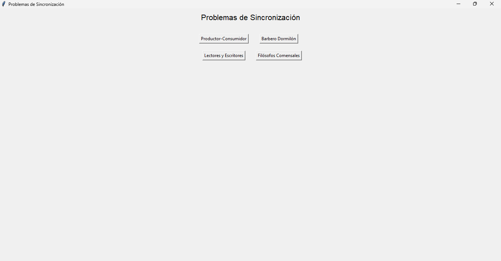
## Productor-Consumidor con GUI 1
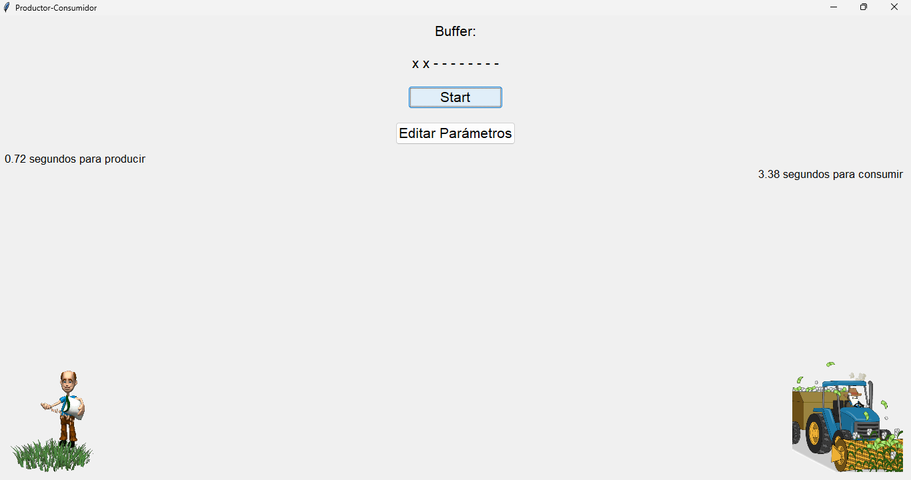
## Productor-Consumidor con GUI 2
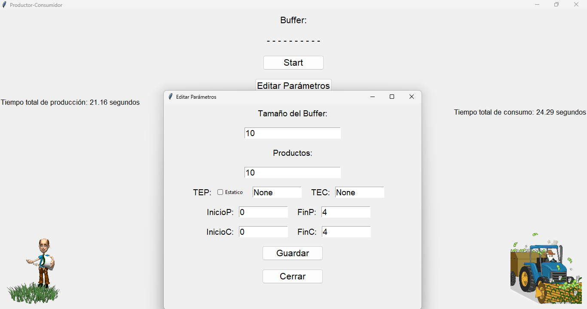
## Barbero-Dormilón con GUI 1
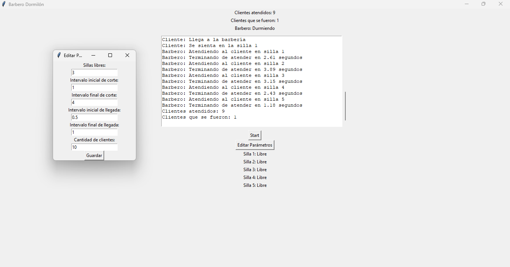
## Barbero-Dormilón con GUI 2
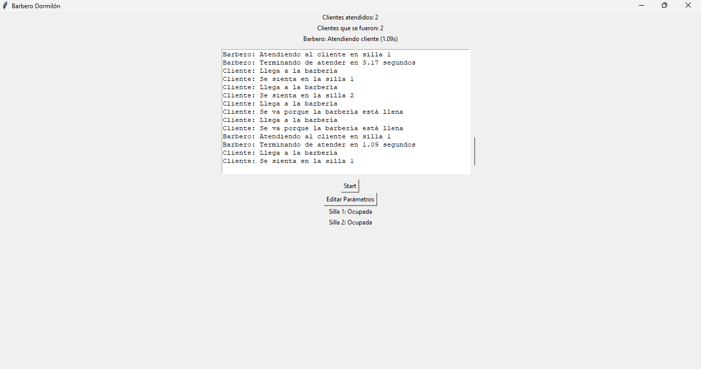
## Lectores-Escritores con GUI 1
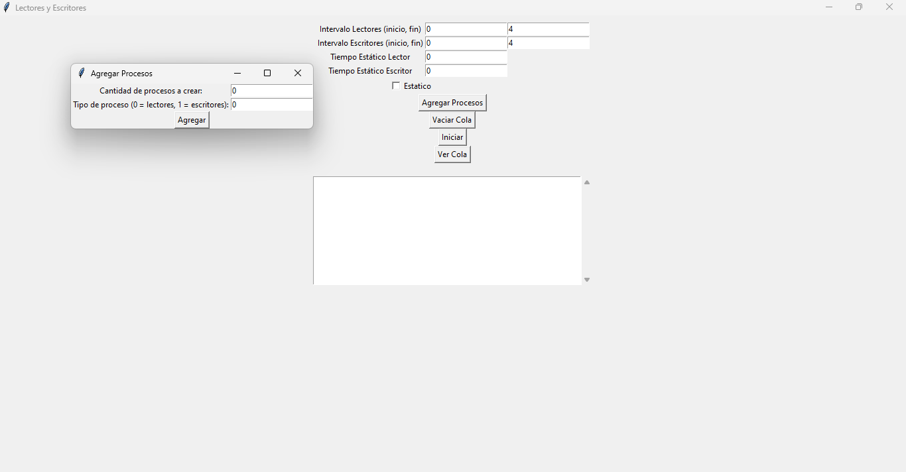
## Lectores-Escritores con GUI 2
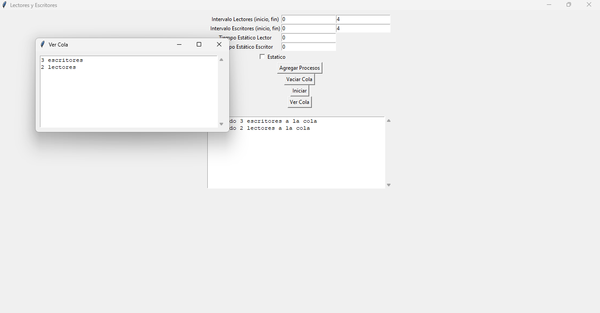
## Lectores-Escritores con GUI 3
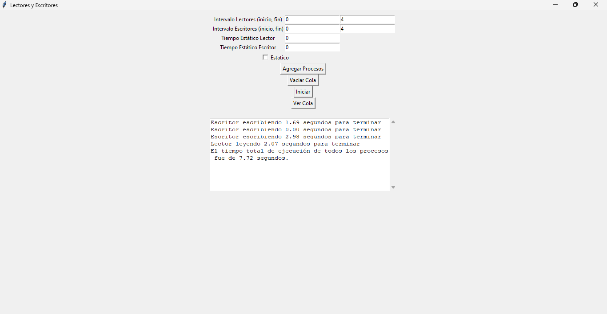
## Filósofos-Comensales con GUI 1

## Filósofos-Comensales con GUI 2
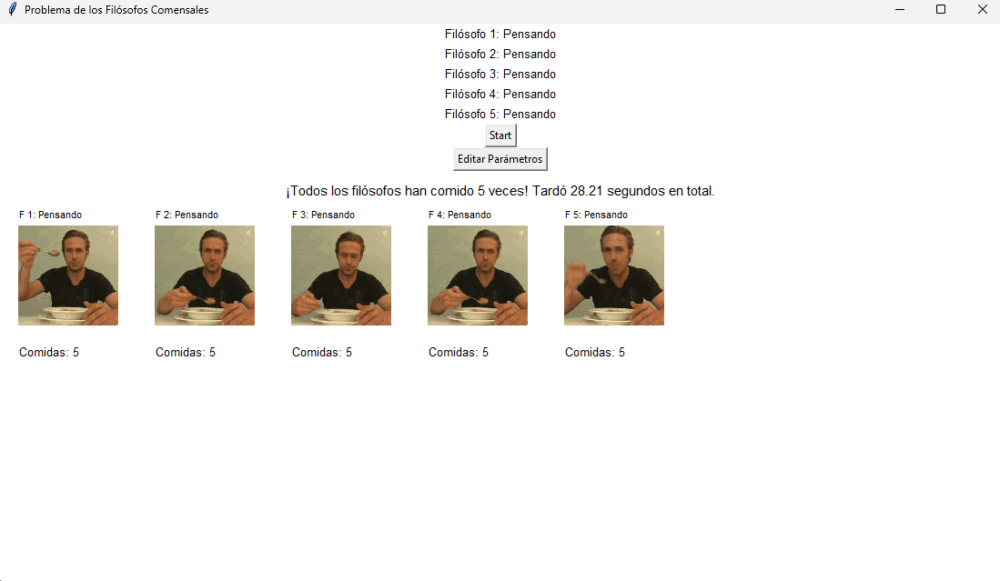
## Filósofos-Comensales con GUI 3

## Menú app CLI

## Productor-Consumidor CLI 1
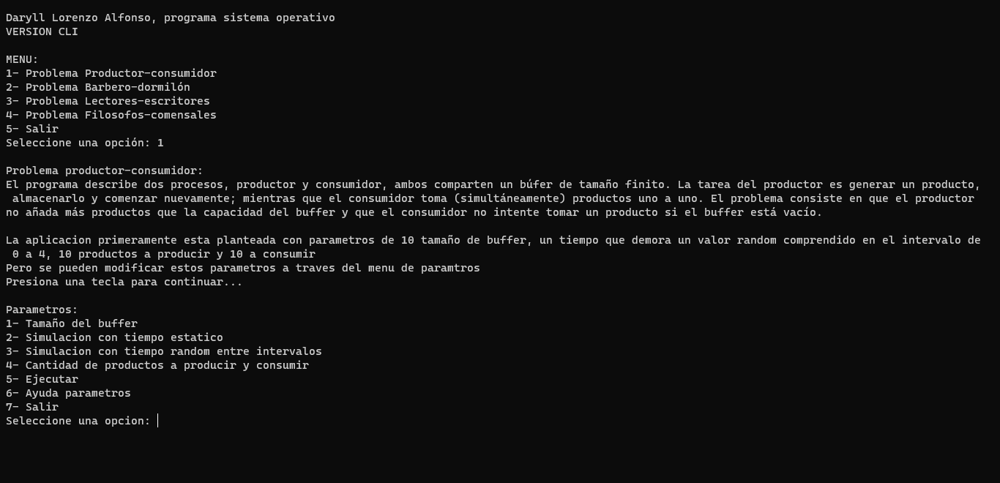
## Productor-Consumidor CLI 2
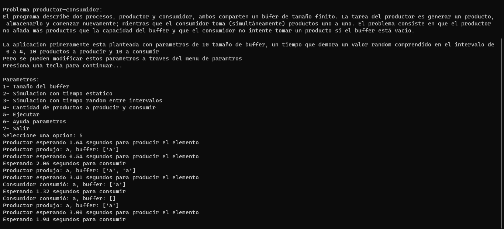

## Barbero-Dormilón CLI 1
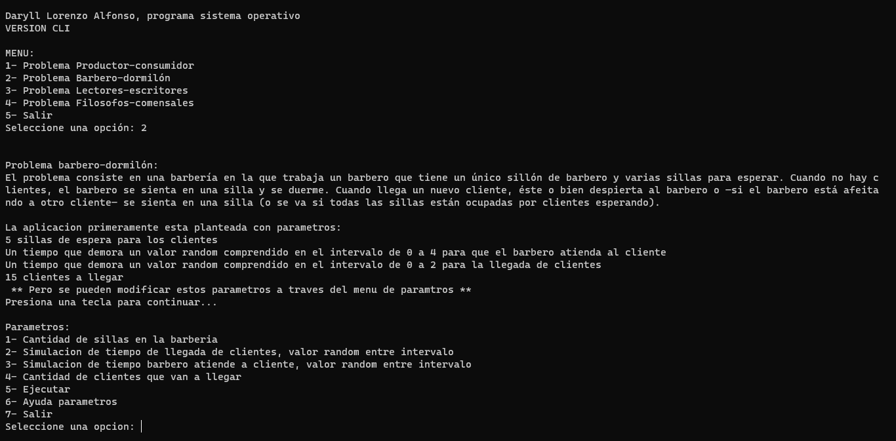

## Lectores-Escritores CLI 1
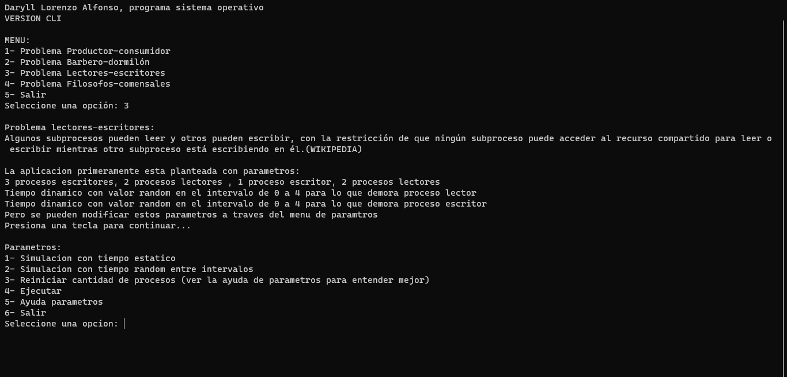

## Filósofos-Comensales CLI 1
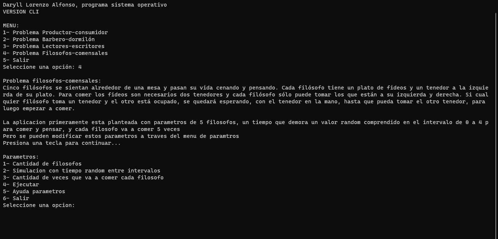